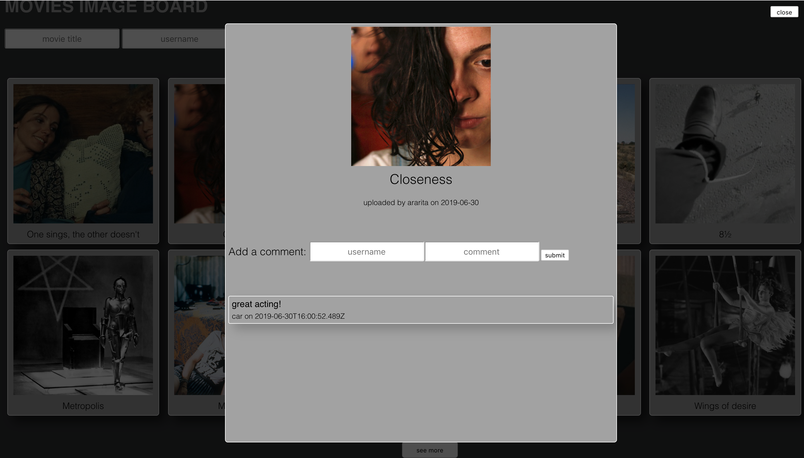

# MOVIES IMAGE BOARD

## Overview

This is instagram inspired image board where anybody can upload a picture from the movie of their choice and see pictures that others have uploaded. 

## Features

-   This application doesn't require registration, but users can add an image along with the title, description and username

-   There is a predefined number of pictures shown, more on users request ('see more' button)

- Click on a picture opens a modal where anybody can leave a comment 

## Technologies

-   HTML
-   CSS
-   jQuery
- Vue.js
- Node.js
- Express 
- PostgreSQL
- AWS S3

## Preview

Image board 

Comments

## Roadmap

Work on additional features like giving users the chance to upload pictures directly from internet, adding 'like' option, use IMDb API to enable extensive movie insight. 